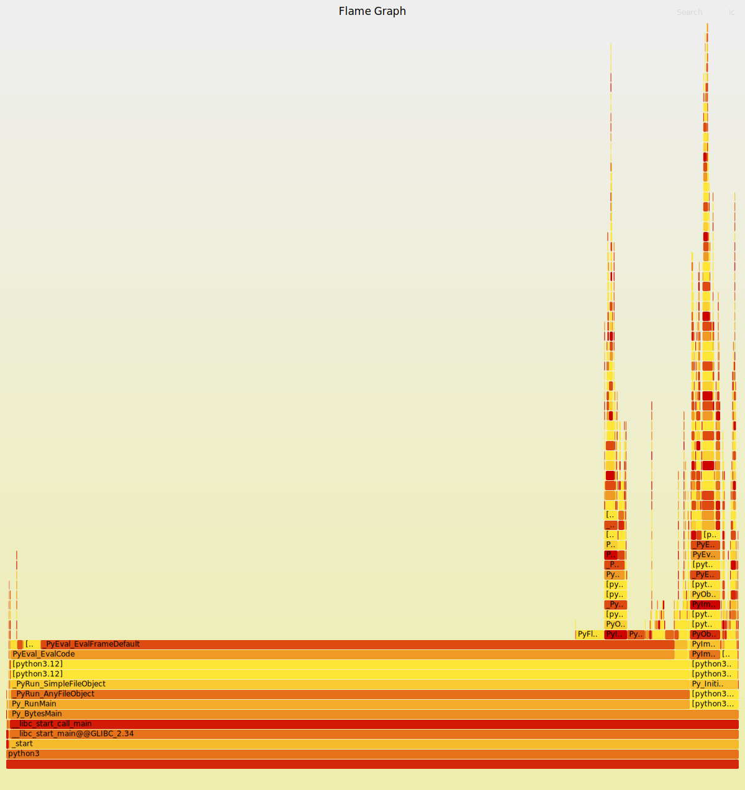

## Basic Timing

### Question 1

```
ubuntu@ubuntu:~/CWM-project/assignment1$ /usr/bin/time -v python3 matmul_slow.py 
n=128 reps=2 checksum=107389.290000
	Command being timed: "python3 matmul_slow.py"
	User time (seconds): 0.21
	System time (seconds): 0.01
	Percent of CPU this job got: 99%
	Elapsed (wall clock) time (h:mm:ss or m:ss): 0:00.23
	Average shared text size (kbytes): 0
	Average unshared data size (kbytes): 0
	Average stack size (kbytes): 0
	Average total size (kbytes): 0
	Maximum resident set size (kbytes): 13356
	Average resident set size (kbytes): 0
	Major (requiring I/O) page faults: 0
	Minor (reclaiming a frame) page faults: 1948
	Voluntary context switches: 33
	Involuntary context switches: 2
	Swaps: 0
	File system inputs: 164
	File system outputs: 0
	Socket messages sent: 0
	Socket messages received: 0
	Signals delivered: 0
	Page size (bytes): 4096
	Exit status: 0

```

User time takes up most of the total execution time, while system time only takes up a small proportion.

### Question 2

```
ubuntu@ubuntu:~/CWM-project/assignment1$ for i in 1 2 3 4 5; do /usr/bin/time -f "%e" python3 matmul_slow.py; done
n=128 reps=2 checksum=107389.290000
0.22
n=128 reps=2 checksum=107389.290000
0.22
n=128 reps=2 checksum=107389.290000
0.22
n=128 reps=2 checksum=107389.290000
0.22
n=128 reps=2 checksum=107389.290000
0.22
```

I would report mean as a summary, as the interference on running time can be averaged out.

## Reading Counters with `perf` stat

### Question 3

```
ubuntu@ubuntu:~/CWM-project/assignment1$ sudo perf stat -e cycles,instructions python3 matmul_slow.py
n=128 reps=2 checksum=107389.290000

 Performance counter stats for 'python3 matmul_slow.py':

         812593332      cycles                                                                
        2299659671      instructions                     #    2.83  insn per cycle            

       0.236425099 seconds time elapsed

       0.226192000 seconds user
       0.009007000 seconds sys
```

`cycles` refers to the total CPU cycle that has elapsed during the `matmul.py` is executing, there are in total $2299659671$  instructions, while the python code includes at least $128^3 = 2,097,152$ loops.

### Question 4

```
ubuntu@ubuntu:~/CWM-project/assignment1$ sudo perf stat -r 5 -e cycles,instructions,cache-misses python3 matmul_slow.py
n=128 reps=2 checksum=107389.290000
n=128 reps=2 checksum=107389.290000
n=128 reps=2 checksum=107389.290000
n=128 reps=2 checksum=107389.290000
n=128 reps=2 checksum=107389.290000

 Performance counter stats for 'python3 matmul_slow.py' (5 runs):

         799707002      cycles                                                                  ( +-  0.09% )
        2295629252      instructions                     #    2.87  insn per cycle              ( +-  0.04% )
            597184      cache-misses                                                            ( +-  2.50% )

          0.223951 +- 0.000357 seconds time elapsed  ( +-  0.16% )

```

The instructions per cycle ratio is $2.87$, this suggests the CPU pipelining is working and performs more than one instruction per cycle.

The cache misses here is $59784$ times in total, the more cache mises, the more times CPU has to look for data not from the cache, but from the memory, which slows down the processing speed.

## Hotspot discovery with `perf` record and `perf` report

### Question 5

```
Samples: 907  of event 'cycles:P', Event count (approx.): 801145658
Overhead  Command  Shared Object      Symbol
  77.20%  python3  python3.12         [.] _PyEval_EvalFrameDefault             
   2.79%  python3  python3.12         [.] PyFloat_FromDouble                   
   2.56%  python3  python3.12         [.] PyLong_FromLong                      
   0.89%  python3  python3.12         [.] PyObject_Free                        
   0.67%  python3  python3.12         [.] _Py_NewReference                     
   0.66%  python3  python3.12         [.] PyObject_Malloc                      
   0.56%  python3  python3.12         [.] 0x0000000000156458                   
   0.55%  python3  [kernel.kallsyms]  [k] __irqentry_text_end                  
   0.53%  python3  [kernel.kallsyms]  [k] inflate_fast                         
   0.45%  python3  python3.12         [.] 0x0000000000156483   
   0.44%  python3  python3.12         [.] 0x000000000021db64                   
   0.33%  python3  python3.12         [.] 0x0000000000156450                   
   0.33%  python3  python3.12         [.] 0x000000000016f7cc                   
   0.33%  python3  python3.12         [.] 0x000000000021cd3a                   
   0.22%  python3  python3.12         [.] PyLong_AsLongAndOverflow             
   0.22%  python3  python3.12         [.] PyObject_GetIter                     
   0.22%  python3  [kernel.kallsyms]  [k] _raw_spin_lock                       
   0.22%  python3  [kernel.kallsyms]  [k] folio_batch_move_lru                 
   0.19%  python3  [kernel.kallsyms]  [k] __alloc_frozen_pages_noprof          
   0.11%  python3  python3.12         [.] 0x00000000001f7aaa  
   ...
```

The `PyEval` consumes the largest fraction, which by their literal meanings I think they are related directly to the program branch and condition controls and data readings&writings. The second largest process is `PyFloat` which is related to the float number calculations, as the python code initializes the code setting all the numbers float. The third largest process is `PyLong` which might be related to large number processes (such as `long int` , `long long int` or even larger numbers).

```
Samples: 920  of event 'cycles:P', Event count (approx.): 807854210
  Children      Self  Command  Shared Object         Symbol
+   99.50%     0.00%  python3  python3.12            [.] _start                                                            ◆
+   99.50%     0.00%  python3  libc.so.6             [.] __libc_start_main@@GLIBC_2.34
+   99.50%     0.00%  python3  libc.so.6             [.] __libc_start_call_main       
+   99.50%     0.00%  python3  python3.12            [.] Py_BytesMain                 
+   95.48%     0.00%  python3  python3.12            [.] PyEval_EvalCode              
+   93.56%    75.15%  python3  python3.12            [.] _PyEval_EvalFrameDefault     
+   92.84%     0.00%  python3  python3.12            [.] Py_RunMain                   
+   92.73%     0.00%  python3  python3.12            [.] _PyRun_AnyFileObject         
+   92.73%     0.00%  python3  python3.12            [.] _PyRun_SimpleFileObject      
+   90.75%     0.00%  python3  python3.12            [.] 0x00000000006b5263           
+   90.65%     0.00%  python3  python3.12            [.] 0x0000000000608b52           
+    8.47%     0.00%  python3  python3.12            [.] PyImport_ImportModuleLevelObject
+    8.47%     0.00%  python3  python3.12            [.] PyObject_CallMethodObjArgs   
+    8.47%     0.00%  python3  python3.12            [.] 0x000000000054a087           
+    8.25%     0.00%  python3  python3.12            [.] 0x000000000058206d           
+    7.53%     0.00%  python3  python3.12            [.] 0x00000000005d36ac           
+    6.66%     0.00%  python3  python3.12            [.] 0x00000000006bc965           
+    6.53%     0.00%  python3  python3.12            [.] 0x00000000006bca35           
+    6.53%     0.00%  python3  python3.12            [.] Py_InitializeFromConfig      
+    5.56%     0.00%  python3  python3.12            [.] 0x00000000005d39f4           
+    5.45%     0.00%  python3  python3.12            [.] 0x00000000006b0bc4           
+    5.17%     3.63%  python3  python3.12            [.] PyFloat_FromDouble           
+    5.12%     0.00%  python3  python3.12            [.] PyObject_Vectorcall          
+    4.93%     0.00%  python3  python3.12            [.] PyImport_Import              
+    4.93%     0.00%  python3  python3.12            [.] PyObject_CallFunction        
+    4.82%     0.00%  python3  python3.12            [.] PyImport_ImportModule        
+    3.91%     0.00%  python3  python3.12            [.] 0x00000000006b1132           
+    3.30%     2.75%  python3  python3.12            [.] PyLong_FromLong              
+    2.45%     0.00%  python3  python3.12            [.] _PyObject_MakeTpCall         
+    2.37%     0.00%  python3  python3.12            [.] 0x00000000005d3759           
+    2.37%     0.00%  python3  python3.12            [.] PyRun_StringFlags            
+    2.13%     0.00%  python3  python3.12            [.] 0x0000000000599c17           
+    2.03%     0.00%  python3  python3.12            [.] 0x00000000005d2acb           
+    1.98%     0.00%  python3  [kernel.kallsyms]     [k] entry_SYSCALL_64_after_hwframe 
+    1.98%     0.00%  python3  [kernel.kallsyms]     [k] do_syscall_64                
+    1.98%     0.00%  python3  [kernel.kallsyms]     [k] x64_sys_call      
```


## Flame Graphs

## Question 6



#### a. Which function dominates runtime?

`Python3` Dominates the runtime, while I suppose the other process with `Py` in their name would all be the sub-process of `Python3` .

#### b. Bottlenecks

The bottleneck would be the 3 layers of loops, as they are expected to execute at least $128^3$ times.

### Question 7

Possible ways to improve the execution speed are to:

- reduce cache misses by trying to call the elements in the same row at once, do either (given $A \times B = C$):
  - `matmul_fast1` access the same row of matrix $A$ and $C$;
  - `matmul_fast3` transposes $B$ first to make sure the $B$ is accessed row-by-row.
- reduce the loop time (e.g. `matmul_fast_2`)