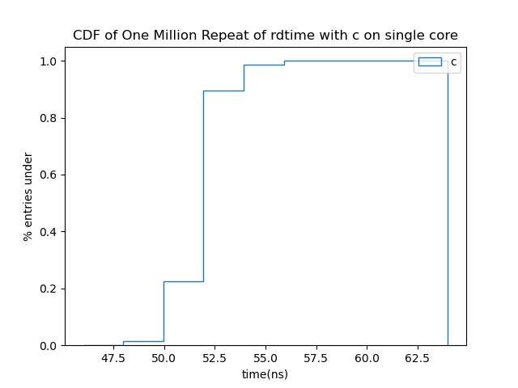

# Report of Assignment 2

- Name: Yucong Cao
- Github Repo Link: [CaoYucong/CWM-Project](https://github.com/CaoYucong/CWM-project)

## Reading Timestamp Counter

### Question 1

```bash
ubuntu@ubuntu:~/CWM-project/assignment2$ for i in 1 2 3 4 5 6 7 8 9 10; do python3 rdtime.py; done
CPU time counter: 247367917243279 ns
CPU time diff: 14185 ns
CPU time counter: 247367936143185 ns
CPU time diff: 14889 ns
CPU time counter: 247367955112848 ns
CPU time diff: 14445 ns
CPU time counter: 247367974208514 ns
CPU time diff: 14219 ns
CPU time counter: 247367993318996 ns
CPU time diff: 15268 ns
CPU time counter: 247368012259227 ns
CPU time diff: 14571 ns
CPU time counter: 247368031415901 ns
CPU time diff: 13434 ns
CPU time counter: 247368050476170 ns
CPU time diff: 14435 ns
CPU time counter: 247368069433511 ns
CPU time diff: 13802 ns
CPU time counter: 247368088358195 ns
CPU time diff: 14495 ns
```

Question 2

```bash
ubuntu@ubuntu:~/CWM-project/assignment2$ python3 rdtime.py 
CPU time counter: 256050674644392 ns
CPU time diff: 13313 ns
CPU min diff time: 118 ns
```


### Question 3

```bash
ubuntu@ubuntu:~/CWM-project/assignment2$ ./rdtime 10
CPU frequency: 0.900 GHz
Minimum consecutive TSC diff: 188 cycles
Approximate time: 208.89 ns
```

### Question 4

```bash
ubuntu@ubuntu:~/CWM-project/assignment2$ ./rdtime 10
CPU frequency: 3.600 GHz
Minimum consecutive TSC diff: 50 cycles
Approximate time: 13.89 ns
```

### Question 5


### Question 6

```bash
ubuntu@ubuntu:~/CWM-project/assignment2$ taskset -c 1 ./rdtime 1000000
CPU frequency: 3.600 GHz
Minimum consecutive TSC diff: 44 cycles
Approximate time: 12.22 ns
```




They should be the same as one single program would only run one core.

### Question 7

|               | Average | Median | $90\%$ | $99\%$ | Max    |
| ------------- | ------- | ------ | ------ | ------ | ------ |
| Python        | 268.54  | 275    | 280    | 310    | 3.5e6  |
| C             | 62.9182 | 52     | 52     | 54     | 1.5e5  |
| C single core | 62.7928 | 52     | 52     | 54     | 1.25e5 |

The time difference of python is bigger than c.

### Question 8

Yes. The Python code takes significantly more time, as python is a higher level language replying on c code, one more layer of translation (compilation) is needed.

### Question 9

The CPU might not be able to work continuously, due to the circuit architecture, there might occur some large time gap between two instructions, due to other activities, or due to some safety regulations that limits CPU from working continuously over a time period.

### Question 10

```bash
ubuntu@ubuntu:~/CWM-project/assignment2$ ping 8.8.8.8 -c 10 -i 0.2
PING 8.8.8.8 (8.8.8.8) 56(84) bytes of data.
64 bytes from 8.8.8.8: icmp_seq=1 ttl=113 time=3.30 ms
64 bytes from 8.8.8.8: icmp_seq=2 ttl=113 time=3.27 ms
64 bytes from 8.8.8.8: icmp_seq=3 ttl=113 time=3.17 ms
64 bytes from 8.8.8.8: icmp_seq=4 ttl=113 time=3.19 ms
64 bytes from 8.8.8.8: icmp_seq=5 ttl=113 time=3.17 ms
64 bytes from 8.8.8.8: icmp_seq=6 ttl=113 time=3.18 ms
64 bytes from 8.8.8.8: icmp_seq=7 ttl=113 time=3.18 ms
64 bytes from 8.8.8.8: icmp_seq=8 ttl=113 time=3.28 ms
64 bytes from 8.8.8.8: icmp_seq=9 ttl=113 time=3.20 ms
64 bytes from 8.8.8.8: icmp_seq=10 ttl=113 time=3.27 ms

--- 8.8.8.8 ping statistics ---
10 packets transmitted, 10 received, 0% packet loss, time 1805ms
rtt min/avg/max/mdev = 3.169/3.220/3.304/0.051 ms
```

### Question 11

```bash
ubuntu@ubuntu:~/CWM-project/assignment2$ ping www.pku.edu.cn -c 10 -i 0.2
PING www.lb.pku.edu.cn (162.105.131.160) 56(84) bytes of data.

--- www.lb.pku.edu.cn ping statistics ---
10 packets transmitted, 0 received, 100% packet loss, time 1870ms
```

```bash
ubuntu@ubuntu:~/CWM-project/assignment2$ ping www.titech.ac.jp -c 10 -i 0.2
PING web-a1n.westeurope.cloudapp.azure.com (20.107.116.39) 56(84) bytes of data.

--- web-a1n.westeurope.cloudapp.azure.com ping statistics ---
10 packets transmitted, 0 received, 100% packet loss, time 1870ms
```

```bash
ubuntu@ubuntu:~/CWM-project/assignment2$ ping www.mit.edu -c 10 -i 0.2
PING e9566.dscb.akamaiedge.net (23.43.64.242) 56(84) bytes of data.
64 bytes from a23-43-64-242.deploy.static.akamaitechnologies.com (23.43.64.242): icmp_seq=1 ttl=51 time=3.35 ms
64 bytes from a23-43-64-242.deploy.static.akamaitechnologies.com (23.43.64.242): icmp_seq=2 ttl=51 time=3.54 ms
64 bytes from a23-43-64-242.deploy.static.akamaitechnologies.com (23.43.64.242): icmp_seq=3 ttl=51 time=3.27 ms
64 bytes from a23-43-64-242.deploy.static.akamaitechnologies.com (23.43.64.242): icmp_seq=4 ttl=51 time=3.30 ms
64 bytes from a23-43-64-242.deploy.static.akamaitechnologies.com (23.43.64.242): icmp_seq=5 ttl=51 time=3.26 ms
64 bytes from a23-43-64-242.deploy.static.akamaitechnologies.com (23.43.64.242): icmp_seq=6 ttl=51 time=3.30 ms
64 bytes from a23-43-64-242.deploy.static.akamaitechnologies.com (23.43.64.242): icmp_seq=7 ttl=51 time=3.49 ms
64 bytes from a23-43-64-242.deploy.static.akamaitechnologies.com (23.43.64.242): icmp_seq=8 ttl=51 time=3.41 ms
64 bytes from a23-43-64-242.deploy.static.akamaitechnologies.com (23.43.64.242): icmp_seq=9 ttl=51 time=3.39 ms
64 bytes from a23-43-64-242.deploy.static.akamaitechnologies.com (23.43.64.242): icmp_seq=10 ttl=51 time=3.54 ms

--- e9566.dscb.akamaiedge.net ping statistics ---
10 packets transmitted, 10 received, 0% packet loss, time 1806ms
rtt min/avg/max/mdev = 3.258/3.383/3.536/0.101 ms
```

Both China university and Japan university are not responding within 1.8s, might due to too complexed Internet connections (too many internal transferring servers that made the respond time too long).

### Question 12

```bash
ubuntu@ubuntu:~/CWM-project/assignment2$ ping 127.0.0.1 -c 10 -i 0.2
PING 127.0.0.1 (127.0.0.1) 56(84) bytes of data.
64 bytes from 127.0.0.1: icmp_seq=1 ttl=64 time=0.019 ms
64 bytes from 127.0.0.1: icmp_seq=2 ttl=64 time=0.017 ms
64 bytes from 127.0.0.1: icmp_seq=3 ttl=64 time=0.018 ms
64 bytes from 127.0.0.1: icmp_seq=4 ttl=64 time=0.017 ms
64 bytes from 127.0.0.1: icmp_seq=5 ttl=64 time=0.018 ms
64 bytes from 127.0.0.1: icmp_seq=6 ttl=64 time=0.018 ms
64 bytes from 127.0.0.1: icmp_seq=7 ttl=64 time=0.017 ms
64 bytes from 127.0.0.1: icmp_seq=8 ttl=64 time=0.018 ms
64 bytes from 127.0.0.1: icmp_seq=9 ttl=64 time=0.017 ms
64 bytes from 127.0.0.1: icmp_seq=10 ttl=64 time=0.017 ms

--- 127.0.0.1 ping statistics ---
10 packets transmitted, 10 received, 0% packet loss, time 1865ms
rtt min/avg/max/mdev = 0.017/0.017/0.019/0.000 ms
```

### Question 13

```bash
ubuntu@ubuntu:~/CWM-project/assignment2$ sudo ping 127.0.0.1 -c 100 -i 0.01
PING 127.0.0.1 (127.0.0.1) 56(84) bytes of data.
64 bytes from 127.0.0.1: icmp_seq=1 ttl=64 time=0.012 ms
64 bytes from 127.0.0.1: icmp_seq=2 ttl=64 time=0.014 ms
64 bytes from 127.0.0.1: icmp_seq=3 ttl=64 time=0.009 ms
64 bytes from 127.0.0.1: icmp_seq=4 ttl=64 time=0.012 ms
64 bytes from 127.0.0.1: icmp_seq=5 ttl=64 time=0.016 ms
64 bytes from 127.0.0.1: icmp_seq=6 ttl=64 time=0.018 ms
64 bytes from 127.0.0.1: icmp_seq=7 ttl=64 time=0.017 ms
64 bytes from 127.0.0.1: icmp_seq=8 ttl=64 time=0.019 ms
64 bytes from 127.0.0.1: icmp_seq=9 ttl=64 time=0.020 ms
64 bytes from 127.0.0.1: icmp_seq=10 ttl=64 time=0.018 ms
64 bytes from 127.0.0.1: icmp_seq=11 ttl=64 time=0.016 ms
64 bytes from 127.0.0.1: icmp_seq=12 ttl=64 time=0.020 ms
64 bytes from 127.0.0.1: icmp_seq=13 ttl=64 time=0.018 ms
64 bytes from 127.0.0.1: icmp_seq=14 ttl=64 time=0.018 ms
64 bytes from 127.0.0.1: icmp_seq=15 ttl=64 time=0.020 ms
64 bytes from 127.0.0.1: icmp_seq=16 ttl=64 time=0.019 ms
64 bytes from 127.0.0.1: icmp_seq=17 ttl=64 time=0.016 ms
64 bytes from 127.0.0.1: icmp_seq=18 ttl=64 time=0.018 ms
64 bytes from 127.0.0.1: icmp_seq=19 ttl=64 time=0.018 ms
64 bytes from 127.0.0.1: icmp_seq=20 ttl=64 time=0.016 ms
64 bytes from 127.0.0.1: icmp_seq=21 ttl=64 time=0.017 ms
64 bytes from 127.0.0.1: icmp_seq=22 ttl=64 time=0.014 ms
64 bytes from 127.0.0.1: icmp_seq=23 ttl=64 time=0.014 ms
64 bytes from 127.0.0.1: icmp_seq=24 ttl=64 time=0.018 ms
64 bytes from 127.0.0.1: icmp_seq=25 ttl=64 time=0.018 ms
64 bytes from 127.0.0.1: icmp_seq=26 ttl=64 time=0.015 ms
64 bytes from 127.0.0.1: icmp_seq=27 ttl=64 time=0.018 ms
64 bytes from 127.0.0.1: icmp_seq=28 ttl=64 time=0.019 ms
64 bytes from 127.0.0.1: icmp_seq=29 ttl=64 time=0.015 ms
64 bytes from 127.0.0.1: icmp_seq=30 ttl=64 time=0.018 ms
64 bytes from 127.0.0.1: icmp_seq=31 ttl=64 time=0.016 ms
64 bytes from 127.0.0.1: icmp_seq=32 ttl=64 time=0.016 ms
64 bytes from 127.0.0.1: icmp_seq=33 ttl=64 time=0.019 ms
64 bytes from 127.0.0.1: icmp_seq=34 ttl=64 time=0.018 ms
64 bytes from 127.0.0.1: icmp_seq=35 ttl=64 time=0.015 ms
64 bytes from 127.0.0.1: icmp_seq=36 ttl=64 time=0.018 ms
64 bytes from 127.0.0.1: icmp_seq=37 ttl=64 time=0.018 ms
64 bytes from 127.0.0.1: icmp_seq=38 ttl=64 time=0.016 ms
64 bytes from 127.0.0.1: icmp_seq=39 ttl=64 time=0.016 ms
64 bytes from 127.0.0.1: icmp_seq=40 ttl=64 time=0.015 ms
64 bytes from 127.0.0.1: icmp_seq=41 ttl=64 time=0.014 ms
64 bytes from 127.0.0.1: icmp_seq=42 ttl=64 time=0.016 ms
64 bytes from 127.0.0.1: icmp_seq=43 ttl=64 time=0.017 ms
64 bytes from 127.0.0.1: icmp_seq=44 ttl=64 time=0.015 ms
64 bytes from 127.0.0.1: icmp_seq=45 ttl=64 time=0.016 ms
64 bytes from 127.0.0.1: icmp_seq=46 ttl=64 time=0.017 ms
64 bytes from 127.0.0.1: icmp_seq=47 ttl=64 time=0.016 ms
64 bytes from 127.0.0.1: icmp_seq=48 ttl=64 time=0.018 ms
64 bytes from 127.0.0.1: icmp_seq=49 ttl=64 time=0.016 ms
64 bytes from 127.0.0.1: icmp_seq=50 ttl=64 time=0.016 ms
64 bytes from 127.0.0.1: icmp_seq=51 ttl=64 time=0.019 ms
64 bytes from 127.0.0.1: icmp_seq=52 ttl=64 time=0.016 ms
64 bytes from 127.0.0.1: icmp_seq=53 ttl=64 time=0.017 ms
64 bytes from 127.0.0.1: icmp_seq=54 ttl=64 time=0.018 ms
64 bytes from 127.0.0.1: icmp_seq=55 ttl=64 time=0.017 ms
64 bytes from 127.0.0.1: icmp_seq=56 ttl=64 time=0.018 ms
64 bytes from 127.0.0.1: icmp_seq=57 ttl=64 time=0.019 ms
64 bytes from 127.0.0.1: icmp_seq=58 ttl=64 time=0.017 ms
64 bytes from 127.0.0.1: icmp_seq=59 ttl=64 time=0.015 ms
64 bytes from 127.0.0.1: icmp_seq=60 ttl=64 time=0.019 ms
64 bytes from 127.0.0.1: icmp_seq=61 ttl=64 time=0.021 ms
64 bytes from 127.0.0.1: icmp_seq=62 ttl=64 time=0.018 ms
64 bytes from 127.0.0.1: icmp_seq=63 ttl=64 time=0.018 ms
64 bytes from 127.0.0.1: icmp_seq=64 ttl=64 time=0.018 ms
64 bytes from 127.0.0.1: icmp_seq=65 ttl=64 time=0.017 ms
64 bytes from 127.0.0.1: icmp_seq=66 ttl=64 time=0.019 ms
64 bytes from 127.0.0.1: icmp_seq=67 ttl=64 time=0.016 ms
64 bytes from 127.0.0.1: icmp_seq=68 ttl=64 time=0.018 ms
64 bytes from 127.0.0.1: icmp_seq=69 ttl=64 time=0.020 ms
64 bytes from 127.0.0.1: icmp_seq=70 ttl=64 time=0.019 ms
64 bytes from 127.0.0.1: icmp_seq=71 ttl=64 time=0.019 ms
64 bytes from 127.0.0.1: icmp_seq=72 ttl=64 time=0.010 ms
64 bytes from 127.0.0.1: icmp_seq=73 ttl=64 time=0.018 ms
64 bytes from 127.0.0.1: icmp_seq=74 ttl=64 time=0.019 ms
64 bytes from 127.0.0.1: icmp_seq=75 ttl=64 time=0.018 ms
64 bytes from 127.0.0.1: icmp_seq=76 ttl=64 time=0.018 ms
64 bytes from 127.0.0.1: icmp_seq=77 ttl=64 time=0.018 ms
64 bytes from 127.0.0.1: icmp_seq=78 ttl=64 time=0.018 ms
64 bytes from 127.0.0.1: icmp_seq=79 ttl=64 time=0.019 ms
64 bytes from 127.0.0.1: icmp_seq=80 ttl=64 time=0.019 ms
64 bytes from 127.0.0.1: icmp_seq=81 ttl=64 time=0.019 ms
64 bytes from 127.0.0.1: icmp_seq=82 ttl=64 time=0.018 ms
64 bytes from 127.0.0.1: icmp_seq=83 ttl=64 time=0.018 ms
64 bytes from 127.0.0.1: icmp_seq=84 ttl=64 time=0.018 ms
64 bytes from 127.0.0.1: icmp_seq=85 ttl=64 time=0.015 ms
64 bytes from 127.0.0.1: icmp_seq=86 ttl=64 time=0.017 ms
64 bytes from 127.0.0.1: icmp_seq=87 ttl=64 time=0.015 ms
64 bytes from 127.0.0.1: icmp_seq=88 ttl=64 time=0.017 ms
64 bytes from 127.0.0.1: icmp_seq=89 ttl=64 time=0.019 ms
64 bytes from 127.0.0.1: icmp_seq=90 ttl=64 time=0.016 ms
64 bytes from 127.0.0.1: icmp_seq=91 ttl=64 time=0.017 ms
64 bytes from 127.0.0.1: icmp_seq=92 ttl=64 time=0.014 ms
64 bytes from 127.0.0.1: icmp_seq=93 ttl=64 time=0.016 ms
64 bytes from 127.0.0.1: icmp_seq=94 ttl=64 time=0.018 ms
64 bytes from 127.0.0.1: icmp_seq=95 ttl=64 time=0.017 ms
64 bytes from 127.0.0.1: icmp_seq=96 ttl=64 time=0.019 ms
64 bytes from 127.0.0.1: icmp_seq=97 ttl=64 time=0.019 ms
64 bytes from 127.0.0.1: icmp_seq=98 ttl=64 time=0.018 ms
64 bytes from 127.0.0.1: icmp_seq=99 ttl=64 time=0.018 ms
64 bytes from 127.0.0.1: icmp_seq=100 ttl=64 time=0.020 ms

--- 127.0.0.1 ping statistics ---
100 packets transmitted, 100 received, 0% packet loss, time 1096ms
rtt min/avg/max/mdev = 0.009/0.017/0.021/0.002 ms
```

The minimum/max difference is quite small. It might comes from some interference.

### Question 14

```bash
ubuntu@ubuntu:~/CWM-project/assignment2$ sudo ping 127.0.0.1 -c 10000 -f
PING 127.0.0.1 (127.0.0.1) 56(84) bytes of data.
 
--- 127.0.0.1 ping statistics ---
10000 packets transmitted, 10000 received, 0% packet loss, time 88ms
rtt min/avg/max/mdev = 0.002/0.002/0.012/0.000 ms, ipg/ewma 0.008/0.002 ms
```

### Question 15


### Question 16

The round trip results are smaller with smaller ping interval, I think this is related to the dynamic resource control of the system, when the network is not under high pressure, there would be less resource, as when ping interval is $0.01 s$,but when the interval is smaller than $0.001s$, the ping requests are queued up,which results in larger process resources being allocated to the network, which finally increases the ping round trip results.

## Performance

### Question 17

Run more resource-consuming process to significantly reduce the CPU resource made available to 

rdtime.c.

### Question 18

Change this

```c
    /*
     * Collect TSC readings.
     */
    for (size_t i = 0; i < num; i++) {
        timestamps[i] = read_tsc();
    }

    /*
     * Initialize minimum difference using first pair.
     */
    uint64_t min_diff = timestamps[1] - timestamps[0];

    /*
     * Compute all consecutive differences and track minimum.
     */
    for (size_t i = 1; i < num; i++) {
        uint64_t diff = timestamps[i] - timestamps[i - 1];
        diffs[i - 1] = diff;

        if (diff < min_diff) {
            min_diff = diff;
        }
    }
```

to 

```c
    /*
    * Collect TSC readings and find smallest interval
    */
	uint64_t min_diff = read_tsc(), last_tsc = 0, diff = 0;
	min_diff = read_tsc() - min_diff;
	for(size_t i = 0; i < num; ++i) {
        last_tsc = read_tsc();
        diff = read_tsc() - last_tsc;
        if (diff < min_diff) { min_diff = diff; }
    }
```

This new code decreases the min_diff by:

- Avoiding accessing different memory block throughout the memory.
- Avoiding the time spent by the `if` sentence.

Result:

```bash
ubuntu@ubuntu:~/CWM-project/assignment2$ for i in 1 2 3 4 5 6 7 8 9 10; do ./rdtime; done
CPU frequency: 3.600 GHz
Minimum consecutive TSC diff: 64 cycles
Approximate time: 17.78 ns
CPU frequency: 3.600 GHz
Minimum consecutive TSC diff: 62 cycles
Approximate time: 17.22 ns
CPU frequency: 3.600 GHz
Minimum consecutive TSC diff: 64 cycles
Approximate time: 17.78 ns
CPU frequency: 3.600 GHz
Minimum consecutive TSC diff: 66 cycles
Approximate time: 18.33 ns
CPU frequency: 3.600 GHz
Minimum consecutive TSC diff: 62 cycles
Approximate time: 17.22 ns
CPU frequency: 3.600 GHz
Minimum consecutive TSC diff: 64 cycles
Approximate time: 17.78 ns
CPU frequency: 3.600 GHz
Minimum consecutive TSC diff: 48 cycles
Approximate time: 13.33 ns
CPU frequency: 3.600 GHz
Minimum consecutive TSC diff: 62 cycles
Approximate time: 17.22 ns
CPU frequency: 3.600 GHz
Minimum consecutive TSC diff: 62 cycles
Approximate time: 17.22 ns
CPU frequency: 3.600 GHz
Minimum consecutive TSC diff: 64 cycles
Approximate time: 17.78 ns
ubuntu@ubuntu:~/CWM-project/assignment2$ for i in 1 2 3 4 5 6 7 8 9 10; do ./rdtime_fast; done
CPU frequency: 3.600 GHz
Minimum consecutive TSC diff: 38 cycles
Approximate time: 10.56 ns
CPU frequency: 3.600 GHz
Minimum consecutive TSC diff: 36 cycles
Approximate time: 10.00 ns
CPU frequency: 3.600 GHz
Minimum consecutive TSC diff: 38 cycles
Approximate time: 10.56 ns
CPU frequency: 3.600 GHz
Minimum consecutive TSC diff: 38 cycles
Approximate time: 10.56 ns
CPU frequency: 3.600 GHz
Minimum consecutive TSC diff: 38 cycles
Approximate time: 10.56 ns
CPU frequency: 3.600 GHz
Minimum consecutive TSC diff: 38 cycles
Approximate time: 10.56 ns
CPU frequency: 3.600 GHz
Minimum consecutive TSC diff: 38 cycles
Approximate time: 10.55 ns
CPU frequency: 3.600 GHz
Minimum consecutive TSC diff: 38 cycles
Approximate time: 10.55 ns
CPU frequency: 3.601 GHz
Minimum consecutive TSC diff: 38 cycles
Approximate time: 10.55 ns
CPU frequency: 3.600 GHz
Minimum consecutive TSC diff: 38 cycles
Approximate time: 10.56 ns
```

### Question 19

$38$ CPU cycles under $3.6GHz$ is $10.5ns$, while the ping averages at $0.0024ms$. So at most 230 times.

### Question 20

```bash
ubuntu@ubuntu:~/CWM-project/assignment1$ python3 matmul_slow.py 
The Average single tile time is ::  5916.4432373046875 cycles
matmul_slow function :: The 0 th run diff =  100257093
The Average single tile time is ::  5943.770446777344 cycles
matmul_slow function :: The 1 th run diff =  100752055
n=128 reps=2 checksum=107389.290000
```

```python
# Intentionally simple O(n^3) matrix multiplication.
# This loop order is correct but cache-unfriendly for matrix B.
def matmul_slow(a: Matrix, b: Matrix, c: Matrix, n: int) -> None:
    average_single_tile_diff = 0; # calculate the single tile time consumption
    for i in range(n):
        for j in range(n):
            total = 0.0
            counter = get_cpu_time_counter()
            for k in range(n):
                total += a[i][k] * b[k][j]
            counter2 = get_cpu_time_counter()
            average_single_tile_diff = average_single_tile_diff + counter2 - counter 
                # add up the total time consumed
            c[i][j] = total
    average_single_tile_diff = average_single_tile_diff / (n * n) # find average
    print('The Average single tile time is :: ', average_single_tile_diff, 'cycles')
```

### Question 21

```
ubuntu@ubuntu:~/CWM-project/assignment1$ python3 matmul_fast.py 
matmul_fast1 function :: The 0 th run diff =  85798849
matmul_fast1 function :: The 1 th run diff =  85344555
n=128 reps=2 checksum=107389.290000
ubuntu@ubuntu:~/CWM-project/assignment1$ python3 matmul_fast.py 
matmul_fast2 function :: The 0 th run diff =  88815375
matmul_fast2 function :: The 1 th run diff =  88691752
n=128 reps=2 checksum=107389.290000
ubuntu@ubuntu:~/CWM-project/assignment1$ python3 matmul_fast.py 
matmul_fast3 function :: The 0 th run diff =  72651099
matmul_fast3 function :: The 1 th run diff =  71799859
n=128 reps=2 checksum=107389.290000
```

The conclusion is the same as previous assignment: the fast2 is only reducing the loops while keeping an $O(n^3)$ algorithm so improvement not significant. The fast1 made accessing matrix $A$ row by row, and fast3 made both $A$ and $B$ accessed row by row, so fast3 is fastest, and fast 1is the second fastest.

### Question 23

- Access the memory right following the cache scheme of the computer to reduce cache miss. (Locality)
- Access the memory only if necessary (reduce large array reading writing..etc.)
- Always try to find algorithm with lower time and space complexity.
