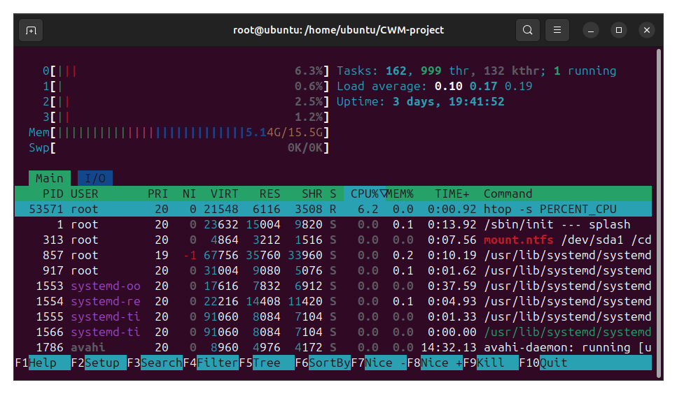
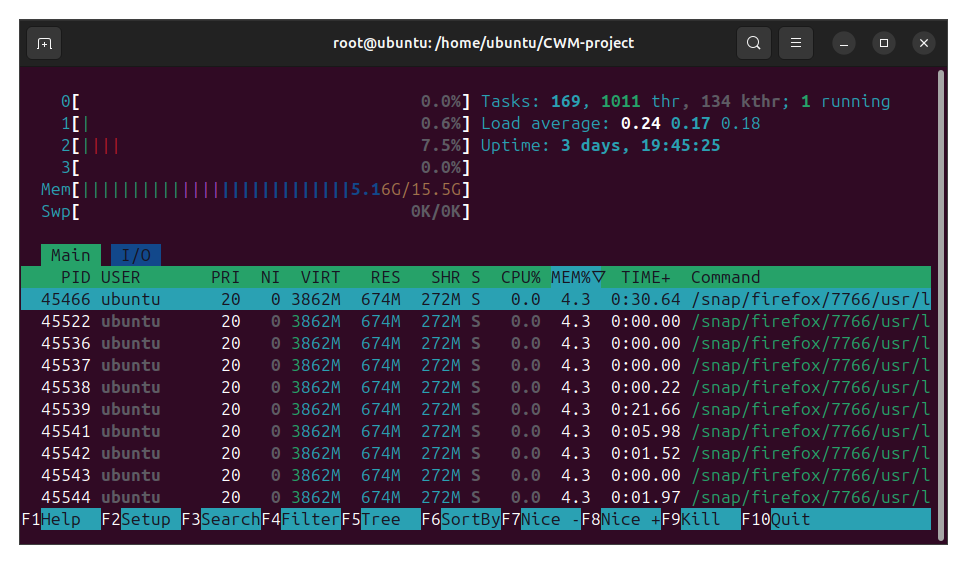
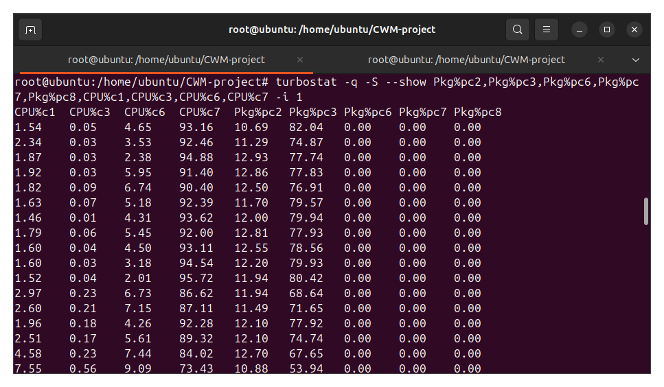
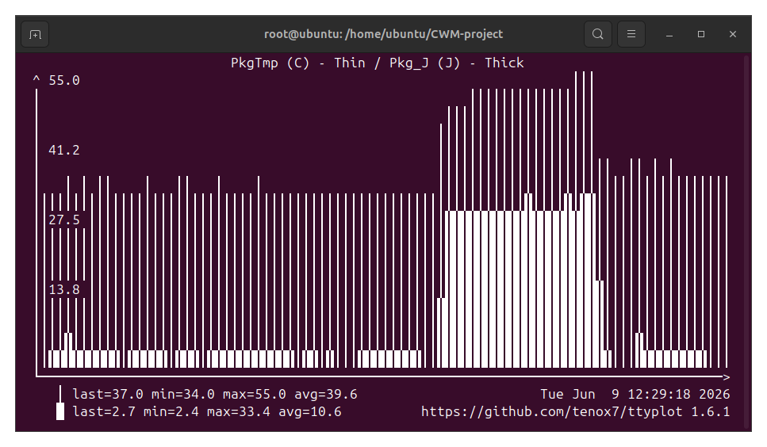

# Report of Assignment 3

- Name: Yucong Cao
- Github Repo Link: [CaoYucong/CWM-Project](https://github.com/CaoYucong/CWM-project)

## Simple Measurements - Idleness

### Question 1





Run any heavy load program, e.g. OpenCV program.

### Question 2

90% of the time. As the CPU core load are at most 10%, this means that the CPU is idle for the rest of the time. For the other cores with only 1% or 2% load, their idle time ratio would be around 98%to 99%.

## Resource Usage - Compute Power, Energy and Thermals

### Question 3

```bash
root@ubuntu:/home/ubuntu/CWM-project# sudo turbostat -q -S --show PkgWatt -i 1
PkgWatt
2.88
2.97
2.91
6.63
3.62
3.69
3.38
6.10
root@ubuntu:/home/ubuntu/CWM-project# sudo turbostat -q -S --Joules --show Pkg_J -i 1
Pkg_J
2.64
2.80
4.45
3.33
3.67
2.58
2.78
1.39
```

The baseline does fluctuate over time, since the system has many processes, their running are not always stationary over time. Small interference would affect how the machine works.

### Question 4

#### Part a

```bash
root@ubuntu:/home/ubuntu/CWM-project# turbostat -q -S --show Busy%,Bzy_MHz,PkgWatt,CorWatt,PkgTmp,CoreTmp -i 1
Busy%	Bzy_MHz	CoreTmp	PkgTmp	PkgWatt	CorWatt
1.07	3586	39	39	2.68	0.95
1.09	3587	32	33	2.72	0.98
1.17	3574	32	32	2.86	1.13
0.72	3576	32	32	2.64	0.91
0.78	3577	32	32	2.74	1.00
1.05	3595	32	32	2.74	1.00
0.78	3573	32	33	2.68	0.95
0.87	3578	32	32	2.73	0.99
0.85	3591	32	33	2.59	0.86
0.65	3590	33	33	2.52	0.78
0.79	3581	32	33	2.59	0.85
2.30	3595	32	32	3.04	1.29
0.76	3578	33	33	2.61	0.87
0.72	3595	31	32	2.58	0.84
1.38	3593	32	32	2.79	1.05
0.84	3576	31	32	2.75	1.01
0.71	3565	32	32	2.65	0.91
1.39	3565	33	33	3.02	1.28
```

#### Part b

The `htop` only measures in timescale about the idleness of the machine, while the `turbostat` shows the actual electrical power consumption. This means that even if the computer is almost totally idle, it still consumes energy.

### Question 5



### Question 6

#### Part a

```bash
CPU%c1	CPU%c3	CPU%c6	CPU%c7	Pkg%pc2	Pkg%pc3	Pkg%pc6	Pkg%pc7	Pkg%pc8
1.54	0.01	2.82	94.86	12.52	79.34	0.00	0.00	0.00
1.76	0.21	4.31	92.65	11.48	79.60	0.00	0.00	0.00
2.16	0.07	3.87	92.09	10.60	76.16	0.00	0.00	0.00
2.06	0.08	4.19	92.46	11.95	77.62	0.00	0.00	0.00
1.14	0.11	2.30	44.58	4.97	38.70	0.00	0.00	0.00
0.23	0.00	0.00	0.00	0.00	0.00	0.00	0.00	0.00
0.23	0.00	0.00	0.00	0.00	0.00	0.00	0.00	0.00
0.23	0.00	0.00	0.00	0.00	0.00	0.00	0.00	0.00
0.23	0.00	0.00	0.00	0.00	0.00	0.00	0.00	0.00
0.23	0.00	0.00	0.00	0.00	0.00	0.00	0.00	0.00
0.23	0.00	0.00	0.00	0.00	0.00	0.00	0.00	0.00
0.23	0.00	0.00	0.00	0.00	0.00	0.00	0.00	0.00
0.23	0.00	0.00	0.00	0.00	0.00	0.00	0.00	0.00
0.23	0.00	0.00	0.00	0.00	0.00	0.00	0.00	0.00
0.23	0.00	0.00	0.00	0.00	0.00	0.00	0.00	0.00
0.23	0.00	0.00	0.00	0.00	0.00	0.00	0.00	0.00
0.23	0.00	0.00	0.00	0.00	0.00	0.00	0.00	0.00
0.23	0.00	0.00	0.00	0.00	0.00	0.00	0.00	0.00
0.23	0.00	0.00	0.00	0.00	0.00	0.00	0.00	0.00
0.23	0.00	0.00	0.00	0.00	0.00	0.00	0.00	0.00
0.23	0.00	0.00	0.00	0.00	0.00	0.00	0.00	0.00
0.23	0.00	0.00	0.00	0.00	0.00	0.00	0.00	0.00
0.23	0.00	0.00	0.00	0.00	0.00	0.00	0.00	0.00
1.85	0.21	3.59	46.59	5.37	37.70	0.00	0.00	0.00
5.82	0.30	8.76	77.19	10.51	55.47	0.00	0.00	0.00
3.23	0.17	6.21	87.82	12.02	71.44	0.00	0.00	0.00
1.24	0.01	2.64	95.44	10.40	82.89	0.00	0.00	0.00
```

```bash
Busy%	Bzy_MHz	CoreTmp	PkgTmp	PkgWatt	CorWatt
1.67	3596	33	33	2.71	0.97
1.38	3573	33	33	2.79	1.05
44.89	3600	46	46	15.68	13.93
99.77	3600	48	48	32.40	30.59
99.77	3600	49	49	32.51	30.70
99.77	3600	50	50	32.56	30.75
99.77	3600	50	50	32.53	30.72
99.77	3600	50	50	32.00	30.15
99.77	3600	51	51	32.00	30.16
99.77	3600	51	51	32.04	30.20
99.77	3600	51	51	32.20	30.38
99.77	3600	51	51	32.22	30.40
99.77	3600	52	52	32.23	30.41
99.77	3600	52	52	32.23	30.41
99.77	3600	52	52	32.30	30.48
99.77	3600	52	52	32.31	30.49
99.77	3600	52	52	32.28	30.46
99.77	3600	54	53	32.26	30.44
99.77	3600	53	53	32.33	30.51
99.77	3600	53	53	32.37	30.55
99.77	3600	53	53	32.33	30.50
99.77	3600	53	53	32.46	30.62
54.08	3600	38	39	18.76	16.95
7.84	3574	38	38	4.84	3.07
2.63	3567	37	38	3.33	1.58
0.66	3596	37	37	2.40	0.66
1.35	3581	37	37	2.78	1.04
2.58	3566	37	37	3.38	1.63
```

#### Part b



#### Part c

The full load power is approximately 7x the idle power. Assume we use the computer at full load for 2hrs per day, the %power on idle will become
$$
\%\text{power idle} = \frac{22\times1}{22\times1 + 2\times7} = 61\%
$$
More than half of the energy would be on idle status.

### Question 7

```bash
ubuntu@ubuntu:~/CWM-project/assignment3$ sudo turbostat -q --Joules -show Pkg_J python3 ../assignment1/matmul_slow.py 500
The Average single tile time is ::  33392.301216 cycles
matmul_slow function :: The 0 th run diff =  8411772768
The Average single tile time is ::  33290.949352 cycles
matmul_slow function :: The 1 th run diff =  8389572846
n=500 reps=2 checksum=477458.000000
16.924469 sec
Pkg_J
195.33
195.33
```

```bash
ubuntu@ubuntu:~/CWM-project/assignment3$ sudo turbostat -q --Joules -show Pkg_J python3 ../assignment1/matmul_fast.py 500
matmul_fast3 function :: The 0 th run diff =  5548104237
matmul_fast3 function :: The 1 th run diff =  5526585465
n=500 reps=2 checksum=477458.000000
11.198754 sec
Pkg_J
125.12
125.12
```

For the same calculation, slow consumed 195.33J J while fast matmul only consumed 125.12 J.

For the average power, $Power_{fast} = 11.17 W$, $Power_{slow} = 11.54W$.

Both match with my intuition, since the slow algorithm involves more memory access, and is slower, so both the power and total energy will all be larger.

### Question 8

