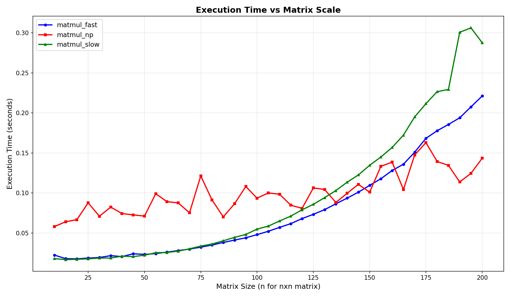
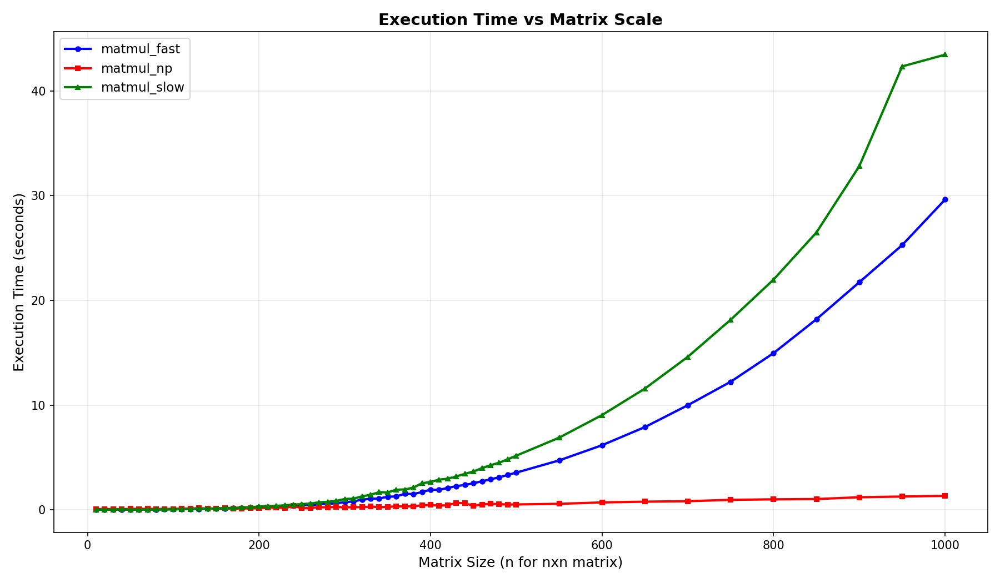
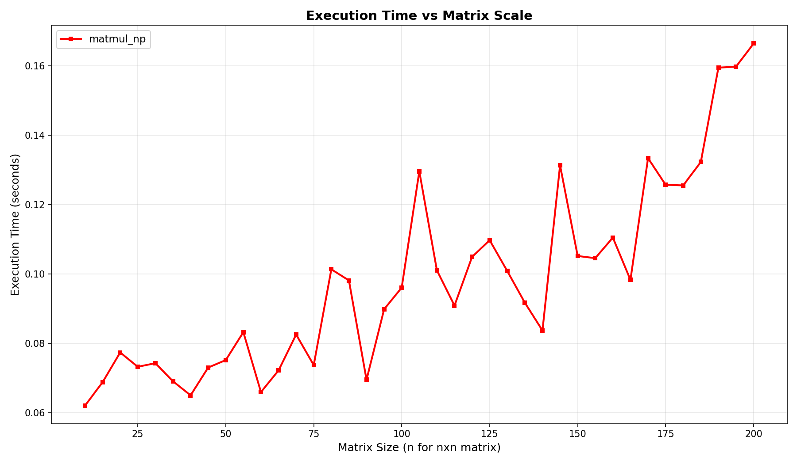
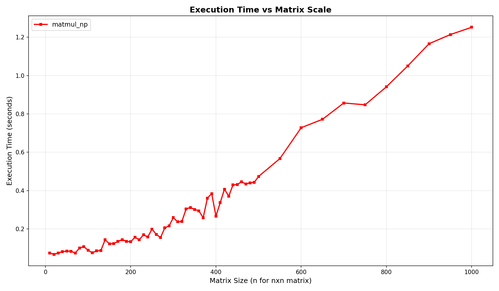
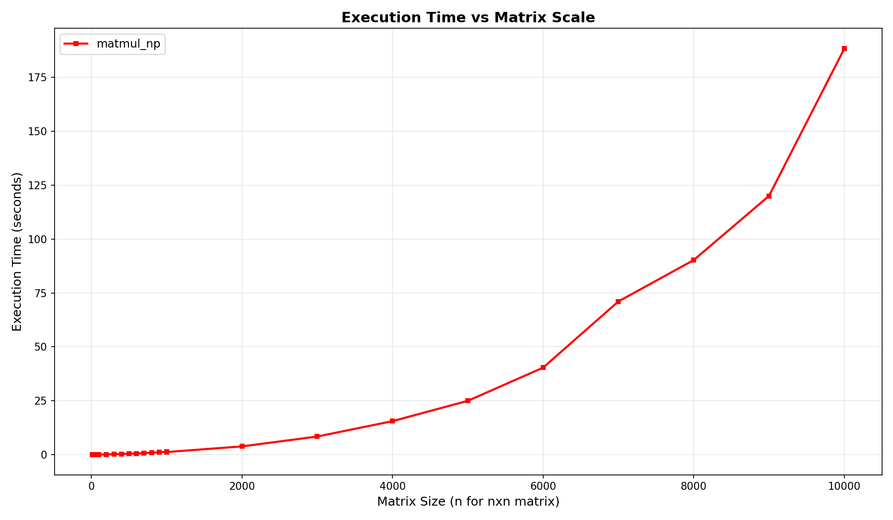

# **Report of Assignment 6**

- **Name:** Yucong Cao
- **GitHub Repository:** [CaoYucong/CWM-Project](https://github.com/CaoYucong/CWM-project)

## **Fuzz Testing**

### **Target**

The fuzz testing process targets `matmul_fast.py` developed in Assignment 1. The purpose of the test is to verify the correctness of the implementation and identify any bugs or vulnerabilities that may emerge under a wide range of input conditions.

### **Test Method**

Correctness testing is performed by cross-checking the output of `matmul_fast.py` against a reference implementation written using NumPy. The same input is provided to both programs, and their outputs are compared for consistency.

The standard input format is as follows: the dimensions of matrix **A** (`rows cols`) are given first, followed by the elements of matrix **A**. The dimensions and elements of matrix **B** are then provided in the same format.

#### **Example Input**

```text
2 3
1.5 2.0 1.9
4.0 5.5 6.0

3 2
7.0 8.0
9.0 1.0
11.0 12.0
```

This corresponds to the matrices
$$
 A =
 \begin{bmatrix}
 1.5 & 2.0 & 1.9 \\
 4.0 & 5.5 & 6.0
 \end{bmatrix},
 \quad
 B =
 \begin{bmatrix}
 7.0 & 8.0 \\
 9.0 & 1.0 \\
 11.0 & 12.0
 \end{bmatrix}.
$$

#### **Example Output**

```text
49.4 36.8
143.5 109.5
```

which corresponds to the product of matrices $A$ and $B$.

### **Input Range**

Unless otherwise stated:

- $rows, cols \leq 100$
- $|A_{ij}| \leq 10$
- $A_{ij} \in \mathbb{Z}$

### **Invalid Input Tests**

Several categories of invalid inputs are tested to identify bugs and robustness issues:

- **Mismatch Test**: The declared dimensions do not match the actual matrix data provided. The program is expected to reject such input by raising an error.
- **Negative-Dimension Test**: One or more matrix dimensions are negative. The program is expected to reject such input by raising an error.

### **Extreme Input Tests**

Several stress tests are also conducted:

- **Float Test**: All matrix elements are randomly generated floating-point values.
- **Large-Number Test**: Matrix elements are randomly generated in the range $10^7$ to $10^9$.
- **Large-Scale Test**: Matrices of size $1000 \times 1000$ with element values below $10^5$.
- **Large-Number-and-Scale Test**: Matrices of size $1000 \times 1000$ with element values between $10^7$ and $10^9$.

------

## **Results**

The following output was produced by the fuzz testing framework:

```bash
caoyucong@Yucongs-MacBook-Pro assignment6 % python3 fuzz_test.py             
Running simple tests: (count=20)
Testing correct multiplication, dimension limited by max_dim.
Simple [##############################] 20/20 passed

Simple timing summary:
  fast   : 20 runs
    mean   = 0.018481 s
    median = 0.018272 s
    min    = 0.017536 s
    max    = 0.021252 s
  np     : 20 runs
    mean   = 0.074316 s
    median = 0.071841 s
    min    = 0.066029 s
    max    = 0.087309 s

Running mismatch tests: (count=20)
Testing dimension mismatch scenarios, should be rejected by both implementations.
Mismatch [##############################] 20/20 rejected

Mismatch timing summary:
  fast   : 20 runs
    mean   = 0.025569 s
    median = 0.025262 s
    min    = 0.024567 s
    max    = 0.029252 s
  np     : 20 runs
    mean   = 0.076097 s
    median = 0.075945 s
    min    = 0.057971 s
    max    = 0.087341 s

Running negative-dimension tests: (count=20)
Testing negative dimension scenarios, should be rejected by both implementations.
Negative-dimension [##############################] 20/20 rejected

Negative-dimension timing summary:
  fast   : 20 runs
    mean   = 0.025099 s
    median = 0.024986 s
    min    = 0.024766 s
    max    = 0.026854 s
  np     : 20 runs
    mean   = 0.073557 s
    median = 0.074159 s
    min    = 0.057713 s
    max    = 0.093924 s

Running large-number tests: (count=20)
Testing large-number values with dimensions limited to 10 and input values from 1e7 to 1e9.
Large-number [##############################] 20/20 passed

Large-number timing summary:
  fast   : 20 runs
    mean   = 0.018277 s
    median = 0.018197 s
    min    = 0.017469 s
    max    = 0.018918 s
  np     : 20 runs
    mean   = 0.078202 s
    median = 0.077552 s
    min    = 0.056670 s
    max    = 0.097989 s

Running float tests: (count=20)
Testing float matrices with dimensions limited to 100 and values under 1e5.
Float [##############################] 20/20 passed

Float timing summary:
  fast   : 20 runs
    mean   = 0.017932 s
    median = 0.017928 s
    min    = 0.017408 s
    max    = 0.018489 s
  np     : 20 runs
    mean   = 0.081865 s
    median = 0.080161 s
    min    = 0.057851 s
    max    = 0.098258 s

Running large-scale tests: (count=1)
Testing large-scale matrices with values under 1e5 and work scaled 1000 by 1000
Large-scale [##############################] 1/1 passed

Large-scale timing summary:
  fast   : 1 runs
    mean   = 29.256139 s
    median = 29.256139 s
    min    = 29.256139 s
    max    = 29.256139 s
  np     : 1 runs
    mean   = 1.328235 s
    median = 1.328235 s
    min    = 1.328235 s
    max    = 1.328235 s

Running large-number-and-scale tests: (count=1)
Testing large-number-and-scale matrices with values from 1e7 to 1e9 and work scaled 1000 by 1000.
Large-number-scale [##############################] 1/1 passed

Large-number-and-scale timing summary:
  fast   : 1 runs
    mean   = 29.633075 s
    median = 29.633075 s
    min    = 29.633075 s
    max    = 29.633075 s
  np     : 1 runs
    mean   = 1.446898 s
    median = 1.446898 s
    min    = 1.446898 s
    max    = 1.446898 s

All fuzz cases passed.
```

All generated test cases passed successfully after bug fixes were applied.

### **Performance Comparison**

The following graphs show the execution time of different implementations (`matmul_slow.py`, `matmul_fast.py`, and NumPy) with respect to matrix size.

#### **Small Scale Matrices ($n \times n$, $n \leq 200$)**

At smaller scales, `matmul_slow.py` and `matmul_fast.py` exhibit similar performance and are both faster than NumPy due to lower initialization overhead.



#### **Large Scale Matrices ($n \times n$, $n \leq 1000$)**

At larger scales, NumPy significantly outperforms both custom implementations. The optimized C/Fortran backend used by NumPy provides substantial performance advantages.

The slower execution time of the custom implementations is expected because NumPy relies on highly optimized low-level linear algebra libraries such as BLAS and LAPACK.



### **Time Complexity Analysis of NumPy**

To verify that NumPy matrix multiplication still follows approximately $O(n^3)$ complexity, additional experiments were performed over increasingly large matrix sizes.

Although the execution time appears relatively flat over some ranges, this is mainly due to highly optimized implementations and small constant factors. Complexity analysis shows that the asymptotic growth remains approximately cubic. In particular, the value of
$$
\frac{\log(\text{time})}{\log(n)}
$$


approaches 3 as the matrix size increases, indicating behavior close to $O(n^3)$.







------

## **Bugs Found and Fixed**

### **Missing Validation for Negative Dimensions**

During fuzz testing, the following issue was discovered:

```bash
Running negative-dimension tests: (count=20)
Testing negative dimension scenarios, should be rejected by both implementations.
Negative-dimension [###---------------------------] 2/20 rejected
[FAIL] test 2: expected negative-dimension failure
fast exit: 0
oracle exit: 0
```

The program incorrectly accepted matrices with negative dimensions.

The issue was fixed by adding validation immediately after reading the matrix dimensions:

```python
if rows < 0 or cols < 0:
    raise ValueError("matrix dimensions must be non-negative")
```

After applying this fix, all negative-dimension test cases were correctly rejected.

### **Long Execution Time for Large Inputs**

Performance testing revealed that execution time becomes very large for matrices of size $1000 \times 1000$:

```text
Large-scale:
fast = 51.40 s
numpy = 2.26 s

Large-number-and-scale:
fast = 52.01 s
numpy = 2.36 s
```

Although the results remain correct, the execution time of `matmul_fast.py` is significantly longer than that of NumPy.

This may become problematic if the implementation is deployed in environments where large matrix multiplication requests are common, such as server-side numerical computing applications.

------

## **Conclusion**

The fuzz testing process successfully verified the correctness of `matmul_fast.py` across a wide variety of normal, invalid, and extreme inputs. One bug related to negative matrix dimensions was discovered and fixed. Performance testing also highlighted a significant scalability limitation compared with NumPy, particularly for large matrices.

Overall, the implementation is functionally correct after the bug fix, although further optimization would be required for large-scale applications.

------

## **Declaration on AI Usage**

GPT-5.5 Instant was used to assist with:

- Debugging standard input/output handling.
- Python syntax issues encountered during development.
- Grammar check with this report.